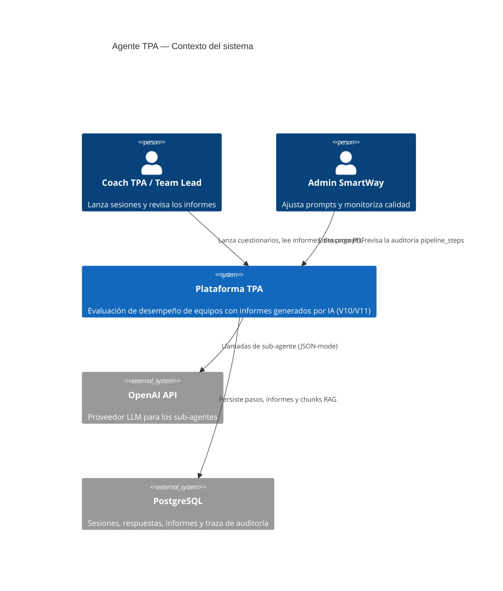
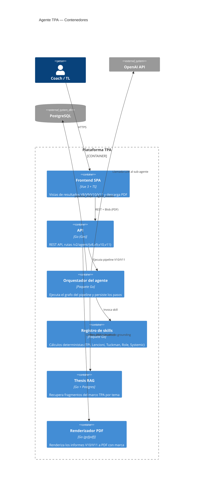
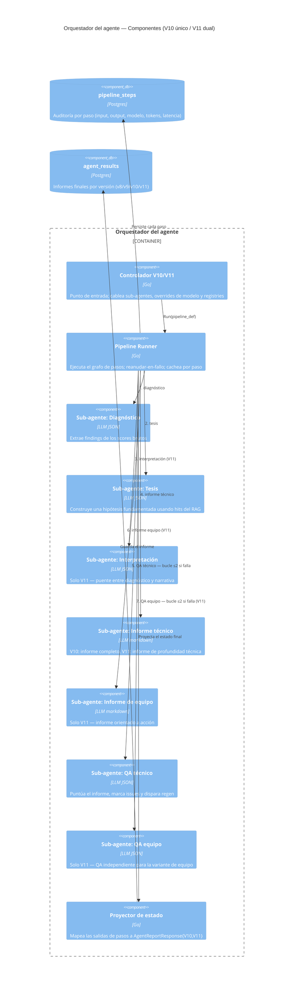
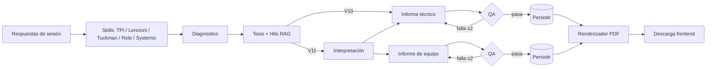

# Agente TPA — Nueva arquitectura V10 y V11

**Audiencia:** Product Manager
**Resumen:** Hemos reconstruido el agente de informes del TPA sobre un pipeline modular y auditable. **V10** es la versión en la nueva arquitectura del antiguo informe único **V9**. **V11** es la versión en la nueva arquitectura del antiguo informe dual **V8**. Mismo output de negocio, mejora drástica en ingeniería y operación.

---

## 1. Qué cambia en un párrafo

Los agentes V8/V9 eran una sola llamada LLM monolítica con un prompt gigante. Los nuevos V10/V11 son **pipelines orquestados**: una secuencia de sub-agentes pequeños y especializados, cada uno con una única responsabilidad (diagnóstico → tesis → informe → auto-auditoría), apoyados en **skills deterministas** para cálculos y lookups y en una capa **Thesis-RAG** que fundamenta la narrativa con el marco teórico TPA. Cada paso se **persiste**, lo que permite reanudar, auditar y regenerar de forma selectiva.

```
V9  (monolito)  ──►  V10 (orquestado, informe único)
V8  (monolito)  ──►  V11 (orquestado, informe dual: técnico + equipo)
```

---

## 2. Qué ganamos

| Capacidad                   | Antes (V8 / V9)                          | Ahora (V10 / V11)                                                       |
| --------------------------- | ---------------------------------------- | ----------------------------------------------------------------------- |
| **Control de calidad**      | Ninguno — lo que devuelva el LLM         | Sub-agente QA audita cada informe; hasta 2 regeneraciones automáticas   |
| **Fiabilidad**              | Fallo → reintento total, coste total     | Reanudar-en-fallo por paso; solo se reejecuta el paso roto              |
| **Coste / eficiencia tokens** | Cada reintento = prompt completo de nuevo | Salidas cacheadas por paso; solo regenera secciones marcadas por QA   |
| **Auditabilidad**           | Caja negra                               | Tabla `pipeline_steps`: input, output, latencia y modelo de cada paso   |
| **Precisión / grounding**   | Solo prompt, propenso a drift            | Thesis-RAG recupera fragmentos del marco TPA; citas en la auditoría     |
| **Determinismo**            | El LLM hacía cálculos                    | Las skills (código Go) calculan scores/lookups; el LLM solo narra       |
| **Iteración de prompts**    | Editar un archivo gigante, desplegar a ciegas | Prompts por paso; cambias uno sin tocar el resto                   |
| **Exportación PDF**         | Captura manual                           | PDF nativo (V10: único; V11: técnico / equipo / ambos)                  |
| **Versionado**              | Difícil de A/B                           | V8, V9, V10 y V11 conviven; los usuarios cambian de ruta                |

**Impacto de negocio:**
- Menos incidencias del tipo "el informe sale raro" — el gate de QA las detecta antes de que llegue al usuario.
- Menor factura de OpenAI — los pasos que fallan no queman todo el pipeline otra vez.
- Experimentación de prompts más rápida — el Prompt Lab edita un sub-agente cada vez.
- Listo para cumplimiento — cada informe tiene una traza de auditoría completa.

---

## 3. V10 vs V11 — qué produce cada uno

| Versión | Sustituye a | Salida                                                       | Caso de uso                                |
| ------- | ----------- | ------------------------------------------------------------ | ------------------------------------------ |
| **V10** | V9          | **Un** informe narrativo integrado                            | Lectura ejecutiva, consumo rápido          |
| **V11** | V8          | **Dos** informes: **Técnico** (profundidad) + **Equipo** (orientado a acción) | Sesión de coach + debrief de equipo en una sola ejecución |

Ambos usan **la misma** arquitectura nueva por debajo — V11 simplemente ejecuta la etapa "informe + QA" dos veces (una por audiencia) con bucles de regeneración independientes.

---

## 4. Modelo C4 — Nueva arquitectura

### Nivel 1 — Contexto del sistema



### Nivel 2 — Contenedores



### Nivel 3 — Componentes (orquestador)



### Nivel 4 — Flujo del pipeline



---

## 5. Notas de riesgo y coste para el PM

- **Presupuesto de tokens:** una ejecución V11 ≈ 7 llamadas LLM frente a 1 en V8. Lo compensamos con (a) prompts más pequeños por paso, (b) pasos cacheados en los reintentos, y (c) regeneración solo del informe que falla, no de todo el pipeline. El coste neto es comparable; **el coste del fallo cae bruscamente**.
- **Latencia:** V11 es secuencial por diseño (cada paso necesita el anterior). El tiempo total ronda 1,5–2× la pared de V8, pero el usuario ve una sola UI de progreso; en una iteración futura podemos paralelizar diagnóstico y skills.
- **Seguridad de rollout:** las rutas V8/V9 permanecen vivas e intactas. V10/V11 son **aditivas**. Riesgo de migración para clientes existentes: cero.
- **Operabilidad:** cada informe trae una huella de auditoría (pasos, modelos, tokens, latencia, fuentes RAG) visible en la UI — soporte puede diagnosticar incidencias en segundos.

---

## 6. Siguientes pasos sugeridos

1. A/B entre V8 y V11 sobre una muestra de sesiones recientes (puntuaciones QA + feedback del coach).
2. Paralelizar pasos independientes (diagnóstico ‖ skills) para recortar ~25% de la latencia de V11.
3. Exponer el Prompt Lab a los admins TPA para experimentación de prompts por paso sin necesidad de dev.
4. Añadir dashboards de coste basados en `pipeline_steps.tokens_in/out` por versión.
